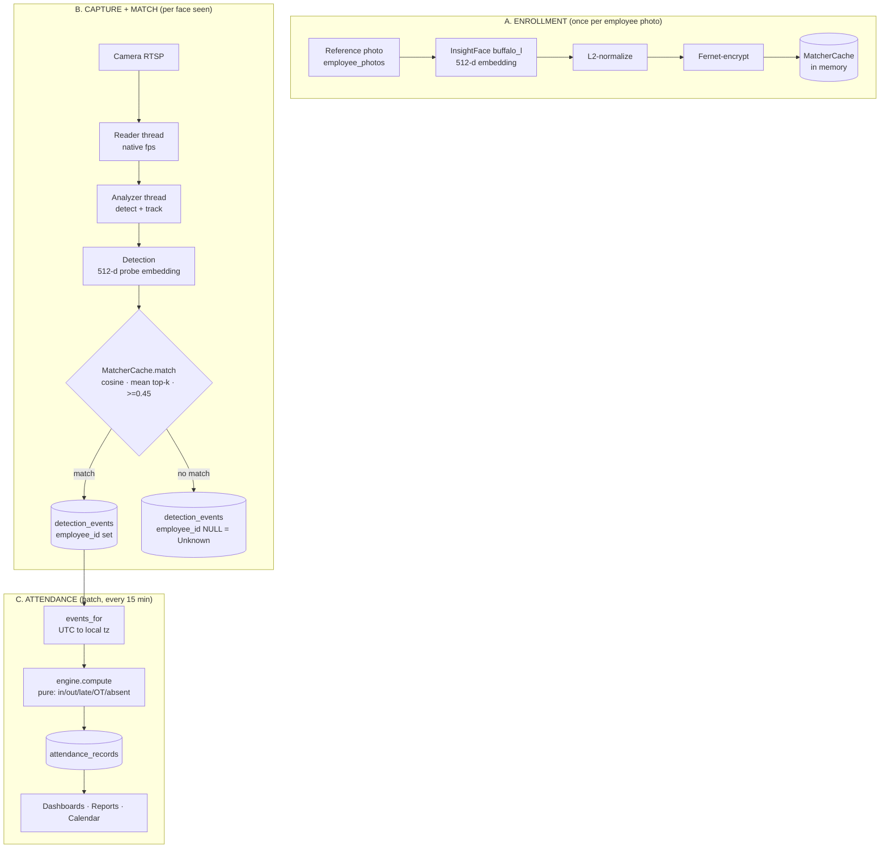

# Attendance & Face-Matching Workflow

> **What this is:** the end-to-end, as-built workflow of how Maugood turns a
> face into an attendance record — enrollment, capture, detection, **face
> matching**, event storage, and attendance computation — plus how the new
> **device-based** source plugs into the same workflow.
>
> Grounded in the live v1.1.x code:
> `maugood/identification/` (enrollment + matcher),
> `maugood/capture/` (reader/analyzer + emit),
> `maugood/attendance/` (engine + scheduler).
> Companion to the interactive walkthrough (published Artifact) and the device
> design in `docs/design/device-attendance-integration.md`.

---

## 0. The workflow at a glance

Three phases: **A** builds the identity gallery once; **B** recognizes faces and
writes "person seen" events; **C** turns events into attendance. The device
source (§7) joins at the boundary between B and C.

---

## A. Enrollment — building the face gallery

Before anyone can be recognized, their reference photos become **embeddings**
in the in-memory matcher.

**Pipeline** (`maugood/identification/enrollment.py`, `embeddings.py`,
`matcher.py`):

1. Admin uploads reference photos → `employee_photos` (P6). Each photo is
   Fernet-encrypted on disk.
2. `enroll_photo` decrypts the photo and runs **InsightFace `buffalo_l`
   recognition** → a **512-float32 embedding**, **L2-normalized**.
3. The embedding is **Fernet-encrypted** and stored in
   `employee_photos.embedding`.
4. `MatcherCache` loads them lazily into memory as
   `{tenant_id → {employee_id → stacked (N, 512) ndarray}}` — N = the
   employee's number of angle photos.

**When enrollment runs:**
| Trigger | Action |
| --- | --- |
| Photo upload (drawer / bulk) | `enroll_photo` immediately |
| Photo delete | `matcher_cache.invalidate_employee` (surgical — only that employee reloads) |
| App startup | `enroll_missing` on a daemon thread |
| On demand | `POST /api/identification/reembed` (Admin) — clears + recomputes |

**Cost:** the gallery scales with **enrolled employees × angles**, not cameras.
~1,000 employees × 3 angles × 512 × 4 B ≈ **~6 MB** in RAM.

---

## B. Capture + face matching — the recognition loop

### B1. Capture (camera source)

`maugood/capture/reader.py` runs **two threads per camera**:

- **Reader** — reads RTSP at native fps, keeps only the latest frame.
- **Analyzer** — loops at ≤ `analyzer_max_fps` (default 3) with **motion-skip**
  (cheap grayscale absdiff; skips detection when nothing moved,
  `force_detect_every_s = 3.0` safety net). It runs the detector, updates the
  **IoU tracker**, and emits **one `detection_events` row per new track** (not
  per frame — that bounds the table no matter how long someone stands there).

Detection uses a module-level model behind a global **`_detect_lock`** — all
detection across every camera is serialized (CPU-bound; this is the system's
throughput ceiling).

### B2. Matching — how a face becomes an employee

This is the heart of the workflow (`emit_detection_event` →
`MatcherCache.match`):

1. The detected face carries a **512-d probe embedding** (from InsightFace).
2. **Cosine similarity** is computed against **every enrolled angle vector** of
   every employee in the tenant (both sides are L2-normalized, so the dot
   product *is* the cosine).
3. Per employee, the score is the **mean of the top-k** similarities
   (**k = 1** → "best-matching angle wins").
4. The highest-scoring employee is assigned **only if** the score is
   **≥ `MAUGOOD_MATCH_THRESHOLD` (default 0.45)**. The threshold is **hard, not
   advisory** — below it, no employee is assigned.
5. Below threshold → `employee_id` stays **NULL** = **Unknown**.

**Lifecycle classification (P28.7):** a match is further classified by the
employee's state, which decides *which column* is populated:
| State | Condition | Result |
| --- | --- | --- |
| `active` | active + today within joining/relieving | `employee_id` set → attendance flows |
| `inactive` | inactive, or past relieving_date | `former_employee_match=true`, `employee_id` NULL (security signal, not attendance) |
| `future` | active but before joining_date | treated as Unknown (lets HR pre-enroll) |

### B3. The event row

`emit_detection_event` writes one `detection_events` row **only after** the
crop is safely written (write-before-INSERT invariant): Fernet-encrypt the crop
→ write to disk → verify → INSERT with `employee_id`, `confidence`, encrypted
`embedding`, `captured_at` (UTC), `track_id`. This row is the **single unit of
truth** the attendance phase consumes.

---

## C. Attendance — events into records

`maugood/attendance/` turns events into the daily record. **The engine is pure
— it only reads `(employee_id, captured_at)` events; it never knows or cares
which source produced them.**

1. **Scheduler** (`scheduler.py`) — an APScheduler job every
   `MAUGOOD_ATTENDANCE_RECOMPUTE_MINUTES` (default 15) calls
   `recompute_today_all_tenants()`. A single-employee/single-date path,
   `recompute_for(...)`, exists for request approvals and is the seed of an
   event-driven path.
2. **Load context** per tenant — timezone, weekend days, holidays
   (`tenant_settings`, P11), and the **active employees** for today (excludes
   future-joiners / post-relievers, P28.7).
3. **Resolve policy** per employee via the cascade
   `Custom > Ramadan > employee > department > tenant > legacy` (one policy per
   employee/date — no stacking).
4. **`events_for`** (`repository.py`) — selects that employee's
   `detection_events` for the day and converts `captured_at` from **UTC → the
   tenant's local timezone** (the load-bearing per-tenant-timezone red line).
5. **`engine.compute()`** — **pure** function: first event = in, last = out,
   then late / early-out / short-hours / overtime / absent, with leave +
   holiday + weekend handling.
6. **`upsert_attendance`** — `ON CONFLICT (tenant_id, employee_id, date)` →
   one row per employee per day. Idempotent, self-healing (a late event is
   absorbed on the next tick).

Result feeds **dashboards, reports (XLSX/PDF), and the calendar** — all
unchanged regardless of source.

---

## 7. How the device source plugs into this workflow

A face-recognition **terminal** does its own detection + matching **on-device**,
so it replaces phase **B** only — phases **A** (optionally) and **C** are
reused unchanged. See `docs/design/device-attendance-integration.md` for the
full spec; the integration points are:

### 7a. Identity mapping (the device's equivalent of matching)

The device reports `employeeNoString` (its person id). Maugood's
**`device_users`** table maps `device_user_id → employee_id` (synced in advance,
matched by employee code). So "the device recognized OM0097" resolves to "employee
Anya Kesh" — this is the device-side analogue of the MatcherCache lookup.

### 7b. Two ways the device uses the matching engine

| Mode | What happens | Uses MatcherCache? |
| --- | --- | --- |
| **A — Trust the device** (default) | Terminal already matched on-board → Maugood maps `device_user → employee` | **No** — engine skipped, lowest CPU |
| **B — Re-match in Maugood** | Terminal sends the captured face → Maugood runs the **exact §B2 engine** | **Yes** — identical to a camera |

### 7c. Same event stream, same attendance

Either way, the processor writes a **`detection_events`** row with
`source='device'`, `employee_id` resolved, `captured_at` = device time (stored
UTC). From there, **phase C runs verbatim** — `events_for` → `engine.compute()`
→ `attendance_records`. Nothing downstream changes.

### 7d. One source at a time

The per-tenant **`attendance_source`** setting (`camera` | `device`) runs only
one pipeline: device-mode stops all camera workers (zero detection CPU),
camera-mode gates off the device sync. Mutually exclusive by design — see the
integration spec §8.

---

## Key parameters (real values)

| Parameter | Value | Where |
| --- | --- | --- |
| Embedding model | InsightFace `buffalo_l` recognition | enrollment + analyzer |
| Embedding dim | 512 float32, L2-normalized | `embeddings.py` |
| Similarity | cosine (dot of normalized) | `matcher.py` |
| Per-employee score | mean of top-k, **k = 1** | `matcher.py` |
| Match threshold | **0.45**, hard (`MAUGOOD_MATCH_THRESHOLD`) | `matcher.py` |
| Detector serialization | global `_detect_lock` | `detection/detectors.py` |
| Analyzer fps | `analyzer_max_fps = 3.0` | `capture/reader.py` |
| Event granularity | 1 row per **new track** | `capture/reader.py` |
| Recompute cadence | every **15 min** + `recompute_for` | `attendance/scheduler.py` |
| Attendance key | `ON CONFLICT (tenant_id, employee_id, date)` | `attendance/repository.py` |

---

## Cross-references

- Interactive walkthrough: published Artifact (7 steps, dummy data)
- Matcher engine: `maugood/identification/matcher.py`
- Enrollment + embeddings: `maugood/identification/{enrollment,embeddings}.py`
- Capture + emit: `maugood/capture/{reader,events}.py`
- Attendance engine: `maugood/attendance/{engine,repository,scheduler}.py`
- Device integration spec: `docs/design/device-attendance-integration.md`
- Current end-to-end architecture: `docs/architecture/current-architecture.md`
- Skills: `face-matching-engine`, `attendance-engine`, `capture-pipeline`
