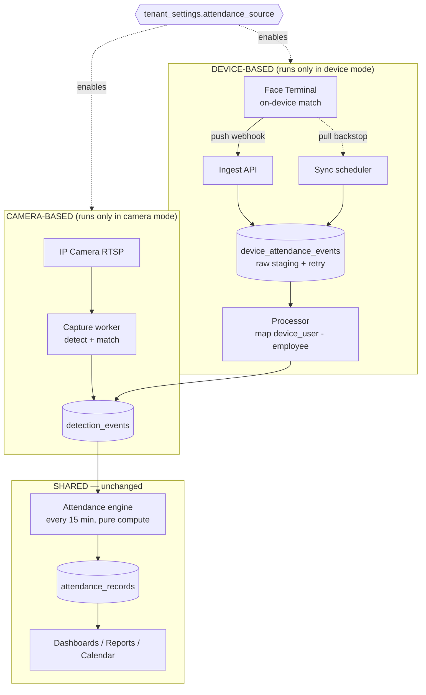
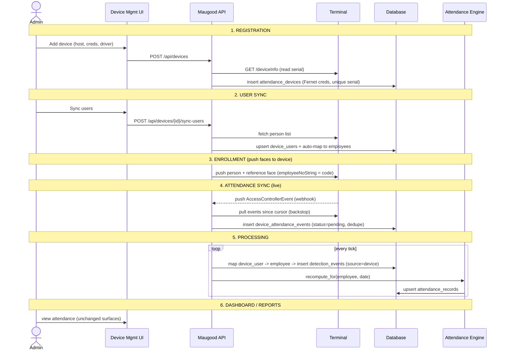
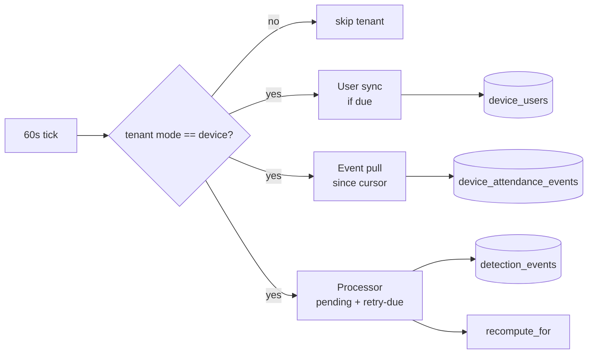

# Attendance Device Integration — End-to-End Design & Technical Specification

> **Status:** Design for review / approval. No code shipped.
> **Audience:** Management (sections 1–4) + engineering (sections 5–13).
> **Supersedes:** the conceptual note `docs/architecture/device-based-attendance.md`
> (kept as the plain-language explainer). This document is the buildable spec.
> **Baseline:** Maugood v1.1.x, Alembic head `0093`. New work starts at `0094`.

---

## 1. Executive summary

Maugood computes attendance today from **IP cameras**: the server detects and
matches every face, writes one "person seen" row per sighting into
`detection_events`, and a 15-minute engine turns those timestamps into
attendance records.

This project adds a **second attendance source**: **face-recognition
terminals** (e.g. Hikvision `DS-K1T671MF`) that match faces **on the device**
and report the result to Maugood. It delivers:

- A dedicated **Device Management** page — register/manage terminals by unique
  serial, sync their users into a dedicated table, and feed the existing
  attendance workflow.
- A tenant-level **Attendance Source** switch — **Camera-Based** or
  **Device-Based** — that runs **only one pipeline at a time**. The unused
  pipeline is fully stopped, so a device-mode site pays **no** camera-detection
  CPU cost, and a camera-mode site runs no device polling.
- The complete operational loop: registration → user sync → attendance sync →
  processing → dashboards/reports → error handling, retries, and recovery.

**Why one mode at a time:** camera face-matching is the system's dominant CPU
cost (the reason 25-camera sites need heavy CPU/GPU). A device-mode site pushes
that cost onto the terminals, so Maugood's server load drops to near-zero for
attendance. Running both simultaneously would waste that saving and duplicate
events, so the modes are **mutually exclusive by design**.

---

## 2. Goals & non-goals

**Goals**
- Register attendance terminals with a **unique device identity** (serial).
- **Synchronize device users** into a dedicated `device_users` table and map
  them to Maugood employees.
- Reuse the **existing attendance engine** unchanged — device events become
  `detection_events` rows.
- A per-tenant **Attendance Source** mode that disables the other pipeline.
- Robust **error handling, retries, and recovery** for an unreliable device
  network.
- Zero disruption to existing camera deployments (default stays Camera-Based).

**Non-goals (this phase)**
- Live video preview from terminals (they are event sources, not RTSP cameras).
- Mixing both sources for the same tenant simultaneously (explicitly excluded —
  one mode at a time).
- Non-Hikvision drivers (designed for, delivered later).

---

## 3. Architecture overview



**The seam:** `attendance/repository.py::events_for` reads `detection_events`
filtered only by `(tenant_id, employee_id, captured_at)`. It is indifferent to
the source. Device events land in the same table with `source='device'`, so the
**engine, scheduler, policies, leaves, holidays, reports, and calendar all work
verbatim.**

---

## 4. End-to-end workflow



Each numbered stage maps to a subsystem in §6–§10.

---

## 5. Database schema changes

New migration **`0094_attendance_devices`** (schema-agnostic; every per-tenant
table carries `tenant_id NOT NULL FK public.tenants`; `maugood_app` gets full
CRUD; no `main`/`public` literals — keeps `test_migration_lint` green).

### 5.1 `attendance_devices` — the device registry

| Column | Type | Notes |
| --- | --- | --- |
| `id` | int PK | |
| `tenant_id` | int NOT NULL FK | isolation |
| `name` | text NOT NULL | operator label |
| `location` | text | |
| `driver` | text NOT NULL | `hikvision` (default) |
| `host` | text NOT NULL | IP / DNS |
| `port` | int NOT NULL | ISAPI port |
| `credentials_encrypted` | text NOT NULL | **Fernet** (user:pass) |
| `webhook_secret_encrypted` | text | **Fernet**; validates pushed events |
| `serial_number` | text NOT NULL | device identity |
| `mac` / `model` / `firmware` | text | auto-read from `deviceInfo` |
| `door_no` | text | |
| `enabled` | bool NOT NULL default true | accept events / run sync |
| `health_status` | text | `online` / `unreachable` / `unknown` |
| `last_user_sync_at` | timestamptz | |
| `last_event_cursor` | text | pull reconciliation cursor |
| `last_seen_at` | timestamptz | |
| `created_at` / `updated_at` | timestamptz | |

**Constraint:** `UNIQUE (tenant_id, serial_number)` — one physical device once
per tenant; survives IP changes.

### 5.2 `device_users` — synchronized device users (dedicated table)

| Column | Type | Notes |
| --- | --- | --- |
| `id` | int PK | |
| `tenant_id` | int NOT NULL FK | |
| `device_id` | int NOT NULL FK attendance_devices ON DELETE CASCADE | |
| `device_user_id` | text NOT NULL | the terminal's person id (`employeeNoString`) |
| `name` | text | as stored on the device |
| `card_no` | text | optional |
| `employee_id` | int NULL FK employees ON DELETE SET NULL | **mapping** to Maugood |
| `mapping_status` | text NOT NULL | `mapped` / `unmapped` / `ambiguous` |
| `face_synced` | bool NOT NULL default false | face pushed to device? |
| `active` | bool NOT NULL default true | |
| `raw` | JSONB | full device payload |
| `synced_at` | timestamptz | last sync |
| `created_at` / `updated_at` | timestamptz | |

**Constraint:** `UNIQUE (tenant_id, device_id, device_user_id)`.
This is the table the requirement calls "synchronize device users into a
separate table"; the attendance workflow consumes it via `employee_id`.

### 5.3 `device_attendance_events` — raw event staging + retry

Separates **ingest** (fast, at-least-once, idempotent) from **processing**
(mapping + attendance), which is what makes retries/recovery clean.

| Column | Type | Notes |
| --- | --- | --- |
| `id` | int PK | |
| `tenant_id` | int NOT NULL FK | |
| `device_id` | int NOT NULL FK | |
| `device_user_id` | text NOT NULL | who the device recognized |
| `event_serial` | text NOT NULL | device's unique event id |
| `occurred_at` | timestamptz NOT NULL | device time → stored UTC |
| `verify_mode` | text | `face` / `card` / `fingerprint` |
| `direction` | text | `in` / `out` / `unknown` |
| `status` | text NOT NULL | CHECK `pending`/`processed`/`failed`/`skipped` |
| `attempts` | int NOT NULL default 0 | retry counter |
| `last_error` | text | last failure reason |
| `next_retry_at` | timestamptz | backoff schedule |
| `employee_id` | int NULL FK | resolved at processing |
| `detection_event_id` | int NULL FK detection_events ON DELETE SET NULL | produced row |
| `raw` | JSONB | full payload |
| `received_at` / `processed_at` | timestamptz | |

**Constraint:** `UNIQUE (tenant_id, device_id, event_serial)` — the
**idempotency key**. A pushed event and the same event later pulled collapse to
one row, so nothing double-counts.

### 5.4 `tenant_settings.attendance_source` — the mode switch

`ALTER TABLE tenant_settings ADD COLUMN attendance_source text NOT NULL
DEFAULT 'camera' CHECK (attendance_source IN ('camera','device'))`.

Default `'camera'` → **every existing deployment keeps behaving exactly as
today** until an operator opts in.

### 5.5 `detection_events` — accept device rows (Option A)

- `camera_id` → make **nullable** (was NOT NULL).
- add `device_id int NULL FK attendance_devices ON DELETE SET NULL`.
- add `source text NOT NULL DEFAULT 'camera' CHECK (source IN ('camera','device'))`.
- make `bbox`, `track_id`, `face_crop_path` **nullable** (a device row has no
  bounding box / crop unless we store the terminal's captured face).

`events_for` is **unchanged** — the new rows already satisfy its filter.

---

## 6. Backend architecture & APIs

### 6.1 Package layout (new)

```
maugood/devices/
  __init__.py
  schemas.py          # Pydantic in/out (creds never in Out)
  repository.py       # tenant-scoped SQL for the 3 tables
  crypto.py           # Fernet wrap/unwrap of device creds + webhook secret
  drivers/
    base.py           # DeviceDriver protocol
    hikvision.py      # ISAPI implementation
  sync_users.py       # pull person list -> upsert device_users + auto-map
  enrollment.py       # push Maugood employees + faces -> device
  ingest.py           # webhook + pull -> device_attendance_events (idempotent)
  processor.py        # staging -> detection_events -> recompute_for
  scheduler.py        # 60s tick: per device, mode-gated
  router.py           # /api/devices/*
maugood/attendance_source/
  service.py          # read/write mode; enforce mutual exclusion
  router.py           # GET/PUT /api/settings/attendance-source
```

### 6.2 Driver abstraction (vendor-neutral)

```python
class DeviceDriver(Protocol):
    def get_info(self, conn) -> DeviceInfo: ...          # serial, mac, model
    def list_users(self, conn) -> list[DeviceUser]: ...  # person list
    def enroll(self, conn, person, face_jpeg) -> None: ...
    def delete_person(self, conn, device_user_id) -> None: ...
    def fetch_events(self, conn, since_cursor) -> tuple[list[DeviceEvent], str]: ...
    def parse_push(self, body, headers) -> list[DeviceEvent]: ...
```

`hikvision.py` implements this over ISAPI (HTTP Digest auth). Dahua / generic
webhook drivers slot in later without touching ingest, processing, or the
attendance engine.

### 6.3 API endpoints (all Admin-only, audited, tenant-scoped; cross-tenant `{id}` → 404)

| Method + Path | Purpose | Audit action |
| --- | --- | --- |
| `GET /api/devices` | List devices (no credentials in response) | — |
| `POST /api/devices` | Register; read `deviceInfo`, encrypt creds, store serial | `device.created` |
| `GET /api/devices/{id}` | Detail + counts (users, pending, failed) | — |
| `PATCH /api/devices/{id}` | Edit; omitted password keeps cipher | `device.updated` |
| `DELETE /api/devices/{id}` | Remove device (+ cascade users/events) | `device.deleted` |
| `POST /api/devices/{id}/test` | Connectivity + auth probe | `device.tested` |
| `POST /api/devices/{id}/sync-users` | Pull device users → `device_users` | `device.users_synced` |
| `GET /api/devices/{id}/users` | List synced users + mapping status | — |
| `PATCH /api/devices/{id}/users/{uid}` | Manually map a device user → employee | `device.user_mapped` |
| `POST /api/devices/{id}/sync-enrollment` | Push employees + faces to device | `device.enrollment_synced` |
| `GET /api/devices/{id}/events` | Raw/failed events (filter by status) | — |
| `POST /api/devices/{id}/events/{eid}/retry` | Requeue a failed event | `device.event_retried` |
| `POST /api/devices/{id}/events/{eid}/skip` | Dead-letter a poison event | `device.event_skipped` |
| `POST /api/devices/events` | **Webhook** — device posts events here | `device.events_ingested` (batch) |
| `GET /api/settings/attendance-source` | Read current mode | — |
| `PUT /api/settings/attendance-source` | Switch mode (Camera ↔ Device) | `settings.attendance_source_changed` |

Event ingest audits **one summary row per batch**, never per event (audit-log
flood control — same rule as the camera path's "no audit per frame").

---

## 7. Sync scheduler & processing logic

One APScheduler tick (reuse the existing 60-second scan; no new scheduler
process). Every stage is **mode-gated**: it only touches tenants whose
`attendance_source = 'device'`.



**User sync** (per device, e.g. every 15 min or on demand): pull the person
list, upsert `device_users`, auto-map to employees by `code`/`card`, flag the
rest `unmapped` for the operator.

**Event ingest** (push primary, pull backstop): insert into
`device_attendance_events` with `status='pending'`, deduped on
`(device_id, event_serial)`. Push gives real-time; the pull cursor backfills
any gap from downtime.

**Processor** (every tick): select `status='pending'` OR
(`status='failed'` AND `next_retry_at <= now()`), then per row: resolve
`device_user_id → device_users.employee_id`; if mapped, insert one
`detection_events` row (`source='device'`, `device_id`, `employee_id`,
`captured_at=occurred_at`), link `detection_event_id`, set `status='processed'`,
and call `recompute_for(employee, date)` (idempotent, single-employee/date —
already exists for request approvals). Unmapped → `status='skipped'` with a
reason (surfaced in UI, not an error). Exception → `attempts++`,
`next_retry_at = now + backoff`, `status='failed'` after N attempts.

---

## 8. Attendance Source mode enforcement (the mutual-exclusion mechanism)

The switch is a per-tenant column; enforcement is at **three** points so a mode
is genuinely off, not just hidden:

1. **Camera pipeline gate.** `CaptureManager.start()` and the 2-second
   reconcile loop read `attendance_source` per tenant. In `device` mode they
   **do not start** camera workers and **stop** any running ones. → zero
   detection CPU on device-mode sites (the cost saving).
2. **Device pipeline gate.** The device scheduler (§7) only runs user sync,
   pulls, and processing for `device`-mode tenants. In `camera` mode the
   webhook still accepts a POST but returns `202 ignored` (mode off) without
   staging — so a mis-configured device can't inject events into a camera-mode
   tenant.
3. **Switch handler.** `PUT /api/settings/attendance-source` performs the
   transition atomically: audit → update column → trigger a reconcile that
   stops one pipeline and starts the other. Switching **camera → device** stops
   all camera workers; **device → camera** pauses device sync (staged data is
   retained, not deleted, so a switch-back resumes cleanly).

Switching is **reversible and non-destructive**: devices, users, and history
persist across a mode flip.

---

## 9. Frontend screens & user flow

Built with the design-system CSS **verbatim** (no Tailwind / CSS-in-JS), data
via TanStack Query, en + ar i18n — same rules as every Maugood page.

| Screen | Route | Contents |
| --- | --- | --- |
| **Device Management** | `/settings/devices` (Admin) | Device table (name, serial, health pill, users-synced, last sync, pending/failed counts) + **Add Device** drawer + row → **Device detail** drawer (Overview / Users / Events & errors / Enrollment tabs). |
| **Add Device drawer** | — | Name, location, driver, host, port, username, password, door no, enrollment scope, enabled. On save → connectivity test + serial read. |
| **Camera Management** | `/cameras` (existing) | Adds a banner when device-mode is active: *"Camera attendance is disabled — source is Device."* Workers shown stopped. |
| **Settings → Attendance Source** | `/settings` | Segmented control **Camera / Device** with a confirmation modal explaining it stops the other pipeline (CPU/cost note). |
| **Dashboard** | `/dashboard` | A **source** indicator (Camera / Device), device-health tiles, and a **failed-events** badge when device-mode. Attendance widgets unchanged. |

**Primary flow:** Add device → Test → Sync users → Map any unmapped →
Sync enrollment (push faces) → flip Attendance Source to **Device** → verify a
test tap appears on the dashboard.

---

## 10. Error handling, retries & recovery

| Failure | Detection | Response | Recovery |
| --- | --- | --- | --- |
| **Device unreachable** | `test` / pull timeout | `health_status='unreachable'`; notification (deduped per outage, reuse camera-unreachable watcher) | Pull cursor backfills the gap when it returns |
| **Bad credentials** | 401 on ISAPI | Surface on device row; sync paused | Operator edits password → re-test |
| **Duplicate event** (push + pull) | `UNIQUE(device_id, event_serial)` | Second insert is a no-op | Automatic — idempotent |
| **Unmapped device user** | processor can't resolve employee | event `status='skipped'` + reason; user flagged `unmapped` | Operator maps user → click **Retry** |
| **Transient processing error** | exception in processor | `attempts++`, exponential backoff (`next_retry_at`) | Auto-retried; **dead-letter** after N attempts |
| **Poison event** | N attempts exhausted | `status='failed'`, shown in Events & errors tab | Operator **Retry** or **Skip** |
| **Maugood downtime** | gap in cursor | none lost — device buffers + pull backfills | Cursor resumes from `last_event_cursor` |
| **Clock skew** | device time ≠ server | store `occurred_at` from device, normalized to UTC | Per-tenant timezone applied on the hot path (unchanged) |

**Delivery guarantee:** at-least-once ingest (push + pull) + a unique event key
= **effectively exactly-once** attendance. Recompute is idempotent, so even a
reprocessed event yields the same record.

---

## 11. Migration strategy for existing deployments

1. **Deploy + migrate.** `0094` adds three tables + `attendance_source`
   (default `'camera'`) + nullable `detection_events` columns. All additive; no
   backfill. Applied to `main` + every tenant schema by the existing
   orchestrator.
2. **No behavior change.** Every current camera site stays in `camera` mode and
   runs exactly as before. The device code paths are dormant until a device is
   added and mode is switched.
3. **Opt-in per tenant.** For a device site: add device → sync users → map →
   push enrollment → flip mode to `device`. Camera workers stop; device sync
   starts.
4. **Reversible.** Flip back to `camera` any time; staged device data is
   retained. `0094` down-migration drops the new tables/columns (only safe
   while no tenant is in device mode).
5. **Backward-compatible reads.** `detection_events` device rows have null
   `camera_id`; existing camera queries that assume a camera join must use outer
   joins — audited during implementation (the calendar + detection-events list
   already tolerate null employee; null camera is the same shape).

---

## 12. Security & red-line compliance

- **Encryption at rest:** device credentials + webhook secret **Fernet**-
  encrypted, exactly like RTSP URLs. Never returned by any endpoint, never
  logged, never in audit rows.
- **Tenant isolation:** all three tables carry `tenant_id` + every query filters
  it; the webhook authenticates the posting device by
  `(tenant_id, serial_number)` + shared secret so one tenant can't inject into
  another; cross-tenant `{id}` → **404 not 403**. Isolation canaries stay green.
- **Webhook hardening:** anonymous (device holds no session) but gated by serial
  + Fernet secret + optional IP allowlist + rate limit + batch audit — modeled
  on the P18 signed-URL surface.
- **Audit:** every device mutation + mode switch audited; ingest audits per
  batch. `maugood_app` keeps INSERT+SELECT-only on `audit_log`.
- **PDPL:** employee hard-delete / GDPR-delete must also `delete_person` on
  every device — erasure reaches the terminal, not just the DB.
- **Per-tenant timezone** unchanged on the attendance hot path.
- **Schema-agnostic migration**, `maugood_app` grants on new tables, lint green.

---

## 13. Rollout phases

| Phase | Deliverable | Gate |
| --- | --- | --- |
| **D1** | Migration `0094`; device registry CRUD; `deviceInfo` read; Fernet creds; unique serial; connectivity test | Add + test a device |
| **D2** | User sync → `device_users`; auto-map + manual map UI | Users listed + mapped |
| **D3** | Attendance Source mode + enforcement (camera stop / device gate) | Mode flip stops camera workers |
| **D4** | Event ingest (pull) + processor + `detection_events` rows + recompute | Attendance from a device tap |
| **D5** | Webhook (push) + dedupe + retry/recovery UI | Real-time + failed-event retry |
| **D6** | Enrollment push (faces → device) + lifecycle + PDPL delete-on-device | Face pushed; erasure reaches device |
| **D7** | Dashboard/report source indicators + health tiles | Management-visible status |
| **D8** | Second driver (Dahua / generic webhook) | Vendor-neutral proof |

---

## 14. Open decisions (need sign-off before D1)

1. **Matching authority:** trust the device's on-device match (recommended) vs
   Maugood re-matches the captured face. → Default: trust device, store its
   confidence.
2. **Mode granularity:** per-tenant (recommended, matches this spec) vs
   per-site/zone (future). → Default: per-tenant.
3. **Enrollment master:** Maugood → device (recommended, Maugood is source of
   truth) vs device → Maugood.
4. **Store device face image?** Save the terminal's captured face as a Fernet
   crop (enables evidence UI + reports) vs skip to save disk. → Default: store.
5. **User-sync cadence:** default 15 min + on-demand button. Confirm.

---

## 15. Cross-references

- Plain-language explainer: `docs/architecture/device-based-attendance.md`
- Interactive prototype: (published Artifact — see chat)
- Attendance engine seam: `maugood/attendance/repository.py::events_for`
- Camera pattern to mirror: `maugood/cameras/`
- Capture manager (mode gate): `maugood/capture/manager.py`
- Tenant settings: `maugood/tenant_settings/` + migration `0029`
- Red lines: `.claude/rules/red-lines.md`
