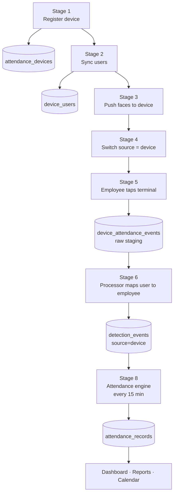

# Device Attendance — Full Process for a Single Device

> **Purpose:** one complete, self-contained walkthrough of everything that
> happens for a **single attendance device**, from the moment it is added to
> the moment attendance appears — including **every database table generated**,
> the **data that flows into each**, how **syncing** works, how **matching**
> resolves, and how **attendance** is computed.
>
> This document follows one concrete device end to end so the whole process is
> visible in one place. Baseline: Maugood v1.1.x. New DB objects start at
> Alembic `0094`.

---

## Contents

1. The device we follow
2. Process map (one picture)
3. Stage 1 — Register the device → `attendance_devices`
4. Stage 2 — Sync device users → `device_users`
5. Stage 3 — Push enrollment (faces onto the device)
6. Stage 4 — Switch attendance source to Device
7. Stage 5 — Capture events → `device_attendance_events` (staging)
8. Stage 6 — Process events → `detection_events`
9. Stage 7 — How matching resolves the person
10. Stage 8 — Compute attendance → `attendance_records`
11. All tables in one place (schemas)
12. Data syncing — how, when, and recovery
13. Error handling & retries
14. End-to-end worked example (one employee's day)
15. Settings & parameters

---

## 1. The device we follow

| Property | Value |
| --- | --- |
| Name | **Main Gate Terminal** |
| Model | Hikvision DS-K1T671MF |
| Serial | `DS7K1T-A1B2C3` |
| Host | `192.168.1.64:80` |
| Tenant | Omran (`tenant_id = 1`) |
| Employees behind it | Anya Kesh `OM0097`, Bilal Ahmed `OM0102`, Dawit Bekele `OM0121` |

Everything below shows the actual rows this one device produces.

---

## 2. Process map (one picture)



**Five tables are involved.** Two are new registries (`attendance_devices`,
`device_users`), one is a new staging queue (`device_attendance_events`), and
two already exist and are reused unchanged (`detection_events`,
`attendance_records`).

---

## 3. Stage 1 — Register the device → `attendance_devices`

**Operator action:** Settings → Devices → **Add Device**. Enter name, host,
port, ISAPI username/password, driver, door number.

**What Maugood does automatically on save:**
1. Connects to `http://192.168.1.64/ISAPI/System/deviceInfo` using the
   credentials.
2. Reads the device **serial number**, MAC, model, firmware.
3. **Fernet-encrypts** the username/password (never stored in plain text).
4. Inserts one row.

**Table generated: `attendance_devices`** — one row for this device:

| id | tenant_id | name | serial_number | host | port | credentials_encrypted | model | enabled | health_status |
|----|-----------|------|---------------|------|------|-----------------------|-------|---------|---------------|
| 1 | 1 | Main Gate Terminal | `DS7K1T-A1B2C3` | 192.168.1.64 | 80 | `gAAAAAB…` 🔒 | DS-K1T671MF | true | online |

**Why the serial matters:** `UNIQUE (tenant_id, serial_number)` guarantees the
same physical terminal cannot be registered twice, and it is how a re-IP'd
device is still recognized as the same unit. The serial is read from the
device, never typed.

**Audit:** `device.created` (host + serial only — never the password).

---

## 4. Stage 2 — Sync device users → `device_users`

**Operator action:** on the device row, click **Sync users** (or it runs on the
schedule). Maugood pulls the terminal's person list and writes each person into
a **separate table**, mapping each to a Maugood employee.

**How mapping works:** the device's `employeeNoString` is matched to a Maugood
employee by **employee code** (`device_user_id == employees.code`). Matches are
flagged `mapped`; anything unmatched is `unmapped` and surfaced for the operator.

**Table generated: `device_users`** — three rows for this device:

| id | tenant_id | device_id | device_user_id | name | employee_id | mapping_status | face_synced |
|----|-----------|-----------|----------------|------|-------------|----------------|-------------|
| 1 | 1 | 1 | `OM0097` | Anya Kesh | 97 | mapped | false |
| 2 | 1 | 1 | `OM0102` | Bilal Ahmed | 102 | mapped | false |
| 3 | 1 | 1 | `OM0121` | Dawit Bekele | 121 | mapped | false |

`UNIQUE (tenant_id, device_id, device_user_id)` keeps re-syncs idempotent — a
second sync updates existing rows instead of duplicating them.

**This is the load-bearing table for the whole workflow:** it is what lets a
device event ("person `OM0097` seen") resolve to a Maugood employee (Anya Kesh,
`employee_id = 97`). Without a mapped row, the event is unidentified.

**Audit:** `device.users_synced` (summary: added / updated / unmapped counts).

---

## 5. Stage 3 — Push enrollment (faces onto the device)

The terminal recognizes faces **on-device**, so each employee's face must live
**inside the terminal**. Maugood pushes it.

**Operator action:** click **Push enrollment** (or it runs on employee
create/activate).

**What Maugood does:** for each mapped employee, take their reference photo from
`employee_photos` (already Fernet-encrypted), decrypt it, and push person + face
to the device via ISAPI (`UserInfo/Record` + `FaceDataRecord`), keyed by
`employeeNoString = employee code`.

**Effect:** `device_users.face_synced` flips to **true**:

| device_user_id | name | face_synced |
|----------------|------|-------------|
| `OM0097` | Anya Kesh | **true** |
| `OM0102` | Bilal Ahmed | **true** |
| `OM0121` | Dawit Bekele | **true** |

Now the terminal can recognize all three on its own.

> **This is the one extra step cameras don't need** — a camera path keeps the
> faces in Maugood and matches server-side; a device needs the faces loaded
> into it. On **employee delete / PDPL erasure**, Maugood also calls
> `delete_person` on the device so erasure reaches the terminal.

**Audit:** `device.enrollment_synced`.

---

## 6. Stage 4 — Switch attendance source to Device

**Operator action:** Settings → **Attendance Source** → choose **Device-Based**
→ confirm.

**Effect (per tenant):**
- The camera pipeline is **stopped** — all camera capture workers shut down, so
  the server does **no** face detection (near-zero CPU).
- The device pipeline is **enabled** — user sync, event ingest, and processing
  start running for this tenant.

**The setting stored:** `tenant_settings.attendance_source = 'device'`.

Only one mode runs at a time by design (CPU + cost). The switch is
**reversible and non-destructive** — devices, users, and history are kept.

**Audit:** `settings.attendance_source_changed` (before/after).

---

## 7. Stage 5 — Capture events → `device_attendance_events` (staging)

**Trigger:** an employee looks at the terminal. The device matches them
on-board, opens the door, and reports the event.

**Two delivery paths (both land in the same staging table, deduped):**
- **Push (real-time):** the device POSTs an `AccessControllerEvent` to
  Maugood's webhook `POST /api/devices/events`. Maugood validates the device
  serial + shared secret, then stages the event.
- **Pull (backstop):** the scheduler periodically calls the device's event API
  for "events since the last cursor", to backfill anything missed.

**Table generated: `device_attendance_events`** — raw staging with retry state.
Anya taps in at 07:31 and out at 15:34:

| id | device_id | device_user_id | event_serial | occurred_at (UTC) | verify_mode | direction | status | attempts |
|----|-----------|----------------|--------------|-------------------|-------------|-----------|--------|----------|
| 5001 | 1 | `OM0097` | `EVT-88121` | 2026-08-03 03:31:04Z | face | in | pending | 0 |
| 5002 | 1 | `OM0097` | `EVT-88490` | 2026-08-03 11:34:12Z | face | out | pending | 0 |

`UNIQUE (tenant_id, device_id, event_serial)` is the **idempotency key** — if
the same event arrives by both push and pull, the second insert is a no-op, so
nothing double-counts. (Times are stored UTC; Omran is UTC+4, so 07:31 local =
03:31Z.)

**Audit:** `device.events_ingested` (one summary row per batch, never per
event).

---

## 8. Stage 6 — Process events → `detection_events`

A processor runs on every scheduler tick. For each `pending` (or retry-due) row
it:

1. Resolves `device_user_id → device_users.employee_id` (`OM0097 → 97`).
2. If mapped, inserts one **`detection_events`** row with `source='device'`.
3. Links it back (`detection_event_id`) and sets the staging row to
   `processed`.
4. Calls `recompute_for(employee, date)` so attendance updates promptly.

**Table reused: `detection_events`** — the device rows sit alongside camera rows
in the same table. `camera_id` is null; `source` is `device`:

| id | tenant_id | source | device_id | camera_id | employee_id | captured_at (UTC) | confidence |
|----|-----------|--------|-----------|-----------|-------------|-------------------|-----------|
| 90231 | 1 | device | 1 | NULL | 97 | 2026-08-03 03:31:04Z | 0.91 |
| 90232 | 1 | device | 1 | NULL | 97 | 2026-08-03 11:34:12Z | 0.93 |

The staging rows are now `processed`:

| id | event_serial | status | employee_id | detection_event_id |
|----|--------------|--------|-------------|--------------------|
| 5001 | `EVT-88121` | processed | 97 | 90231 |
| 5002 | `EVT-88490` | processed | 97 | 90232 |

**Why this design:** separating **ingest** (fast, idempotent) from
**processing** (mapping + attendance) is what makes retries and recovery clean
— a mapping problem or a transient error retries on the staging row without
losing the event.

---

## 9. Stage 7 — How matching resolves the person

Two possible modes decide *how* the identity is established. Both end in the
same `detection_events` row.

| Mode | Where matching happens | Uses Maugood's engine? |
| --- | --- | --- |
| **A — Trust the device** (default) | On the terminal (on-board face DB). Maugood maps `device_user → employee` via `device_users`. | No — lowest CPU |
| **B — Re-match in Maugood** | The device sends the captured face; Maugood runs its existing matcher | Yes |

**Mode B uses the same engine the camera pipeline uses:**
- The face → **512-d InsightFace `buffalo_l` embedding**, L2-normalized.
- **Cosine similarity** against every enrolled employee vector.
- Per-employee score = **mean of top-k (k=1)** — best angle wins.
- Assign the highest scorer **only if ≥ `MAUGOOD_MATCH_THRESHOLD` (0.45)** — a
  **hard** threshold. Below it → **Unknown** (`employee_id` NULL).

For this device (Mode A, default) the "match" is the `device_users` lookup:
`OM0097 → employee 97 (Anya Kesh)`. The stored `confidence` (0.91) is the
device's own score.

---

## 10. Stage 8 — Compute attendance → `attendance_records`

The **existing** attendance engine runs unchanged — it reads
`detection_events` by `(employee_id, captured_at)` and doesn't care that the
source is a device.

**Every 15 minutes** (and immediately via `recompute_for`), for Anya on
2026-08-03:
1. Load tenant timezone (Asia/Muscat), weekend days, holidays.
2. Resolve her shift policy (the cascade).
3. `events_for` → pull her two device events, convert **UTC → local**:
   03:31Z → **07:31**, 11:34Z → **15:34**.
4. Pure `engine.compute()` → in 07:31, out 15:34, on time, +4 min overtime,
   total 8h 03m.
5. Upsert (`ON CONFLICT (tenant_id, employee_id, date)`).

**Table reused: `attendance_records`** — one row per employee per day:

| tenant_id | employee_id | date | in_time | out_time | total_minutes | late | overtime | source |
|-----------|-------------|------|---------|----------|---------------|------|----------|--------|
| 1 | 97 | 2026-08-03 | 07:31 | 15:34 | 483 | false | 4 | device |

This is the final result — visible on the dashboard, calendar, and reports,
identical in shape to a camera-sourced record.

---

## 11. All tables in one place (schemas)

Migration **`0094_attendance_devices`** (schema-agnostic; `tenant_id NOT NULL`
on every table; `maugood_app` CRUD grants; no `main`/`public` literals).

### `attendance_devices` (new)
`id, tenant_id, name, location, driver, host, port, credentials_encrypted
(Fernet), webhook_secret_encrypted (Fernet), serial_number, mac, model,
firmware, door_no, enabled, health_status, last_user_sync_at,
last_event_cursor, last_seen_at, created_at, updated_at`
— **UNIQUE (tenant_id, serial_number)**.

### `device_users` (new)
`id, tenant_id, device_id → attendance_devices, device_user_id, name, card_no,
employee_id → employees (nullable), mapping_status, face_synced, active, raw
JSONB, synced_at, created_at, updated_at`
— **UNIQUE (tenant_id, device_id, device_user_id)**.

### `device_attendance_events` (new — staging + retry)
`id, tenant_id, device_id, device_user_id, event_serial, occurred_at,
verify_mode, direction, status (pending/processed/failed/skipped), attempts,
last_error, next_retry_at, employee_id (nullable), detection_event_id
(nullable), raw JSONB, received_at, processed_at`
— **UNIQUE (tenant_id, device_id, event_serial)** (idempotency).

### `tenant_settings.attendance_source` (new column)
`text NOT NULL DEFAULT 'camera' CHECK (attendance_source IN ('camera','device'))`.

### `detection_events` (existing — additive changes)
`camera_id` → nullable; add `device_id` (nullable FK), `source` (default
`'camera'`, CHECK `camera`/`device`); `bbox`, `track_id`, `face_crop_path` →
nullable for device rows.

### `attendance_records` (existing — unchanged)
No schema change. Device rows flow in via the shared engine.

---

## 12. Data syncing — how, when, and recovery

All syncing runs on one 60-second scheduler tick, **gated by
`attendance_source = 'device'`** (a camera-mode tenant is skipped entirely).

| Sync | What it does | Cadence | Idempotency |
| --- | --- | --- | --- |
| **User sync** | Pull the device person list → upsert `device_users` + auto-map | ~15 min + on-demand | `UNIQUE(device_id, device_user_id)` upsert |
| **Enrollment push** | Push employee faces → device | on employee lifecycle + on-demand | overwrites device person |
| **Event pull** | Pull events since `last_event_cursor` → stage | 60 s | `UNIQUE(device_id, event_serial)` |
| **Event push** | Device POSTs to webhook → stage | real-time | same key |
| **Processing** | Staging → `detection_events` → `recompute_for` | 60 s | one detection_event per staged row |

**Cursor-based recovery:** each device stores `last_event_cursor`. If Maugood is
down or the network drops, the terminal buffers events; the next pull resumes
from the cursor and backfills the gap — **no events are lost**. Push + pull
together give **at-least-once** delivery; the unique event key makes it
**effectively exactly-once**.

---

## 13. Error handling & retries

| Failure | Detection | Response | Recovery |
| --- | --- | --- | --- |
| Device unreachable | pull/test timeout | `health_status='unreachable'` + notification (deduped per outage) | cursor backfills on return |
| Bad credentials | 401 on ISAPI | surfaced on device row; sync paused | operator edits password → re-test |
| Duplicate event | unique key | second insert no-op | automatic |
| Unmapped user | processor can't resolve employee | staging row `skipped` + reason | operator maps user → **Retry** |
| Transient error | exception in processor | `attempts++`, exponential backoff (`next_retry_at`) | auto-retried; dead-letter after N |
| Poison event | attempts exhausted | `status='failed'`, shown in device's Events tab | operator **Retry** or **Skip** |
| Maugood downtime | cursor gap | none lost | resumes from `last_event_cursor` |

Because `recompute_for` is idempotent, even a re-processed event yields the same
attendance row.

---

## 14. End-to-end worked example (one employee's day)

Anya Kesh, 2026-08-03, seen only by **Main Gate Terminal**. Watch the same fact
move through all five tables:

```
07:31 local  Anya taps IN
   attendance_devices     device 1 online
   device_users           OM0097 → employee 97 (mapped, face_synced)
   device_attendance_events  5001  EVT-88121  in   03:31Z  pending → processed
   detection_events        90231  source=device  employee 97  03:31Z  conf 0.91
15:34 local  Anya taps OUT
   device_attendance_events  5002  EVT-88490  out  11:34Z  pending → processed
   detection_events        90232  source=device  employee 97  11:34Z  conf 0.93
15:45 (next 15-min tick)  engine recomputes
   attendance_records      emp 97  2026-08-03  in 07:31  out 15:34  483 min  OT +4  source=device
```

One tap → one staged row → one detection event → folded into one attendance
record. That is the complete life of a single device event.

---

## 15. Settings & parameters

| Setting | Default | Effect |
| --- | --- | --- |
| `attendance_source` | `camera` | `device` stops cameras + runs device pipeline |
| `MAUGOOD_MATCH_THRESHOLD` | 0.45 | hard match cut-off (Mode B re-match) |
| User-sync cadence | ~15 min | how often the device person list refreshes |
| Event pull cadence | 60 s | backstop poll interval |
| Processing retry | exp. backoff, N attempts | before an event dead-letters |
| Matching mode | Mode A (trust device) | vs Mode B (re-match in Maugood) |

---

## Related documents

- Interactive walkthrough (dummy-data, 7 steps): published Artifact.
- Full technical/design spec (APIs, drivers, rollout): `docs/design/device-attendance-integration.md`.
- Existing matching + attendance workflow (as-built): `docs/attendance-workflow.md`.
- Plain-language camera-vs-device explainer: `docs/architecture/device-based-attendance.md`.
